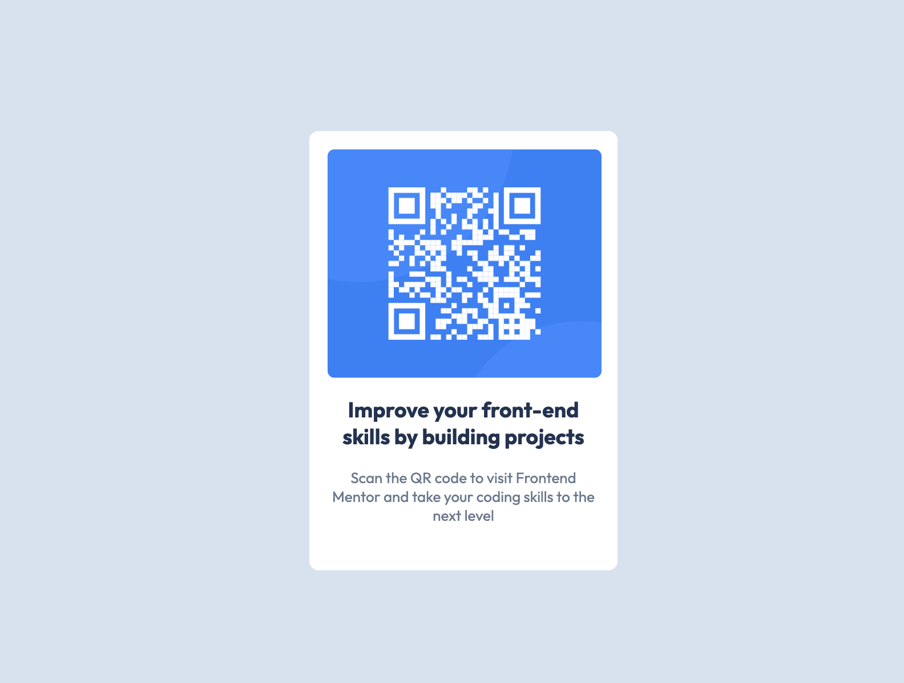

# Frontend Mentor - QR code component solution

This is a solution to the [QR code component challenge on Frontend Mentor](https://www.frontendmentor.io/challenges/qr-code-component-iux_sIO_H).


  - [Screenshot](#screenshot)
  - [Links](#links)
- [My process](#my-process)
  - [Built with](#built-with)
  - [What I learned](#what-i-learned)
  
- [Author](#author)
- [Acknowledgments](#acknowledgments)


### Screenshot



### Links

- Solution URL: [github](https://github.com/SolomonMacharia/qr-code-component-main)
- Live Site URL: [Add live site URL here](https://your-live-site-url.com)

## My process

### Built with

- Semantic HTML5 markup
- CSS custom properties

### What I learned

Properly centering a div using css.


```css
.div {
  position: absolute;
  left: 50%;
  top: 50%;
  transform: translate(-50%, -50%);
}
```

## Author

- Website - [Add your name here](https://www.your-site.com)
- Frontend Mentor - [@SolomonMacharia](https://www.frontendmentor.io/profile/SolomonMacharia)
- Twitter - [@Solomon Macharia](https://x.com/Masharia__254)
